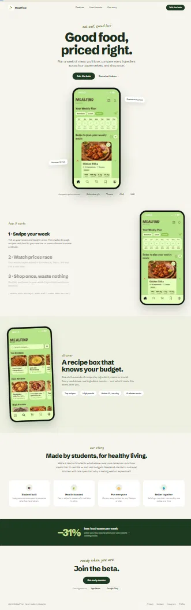

# MealFind website

The marketing site for [MealFind](https://mealfind.co.uk), a free UK recipe app
that prices a whole recipe across supermarkets instead of one product at a time.
Plan a week of meals, see what each one costs at Tesco, Sainsbury's and ASDA,
and shop from a single list.

This repo is the website only. The app itself lives elsewhere and isn't open
source (yet).



## Running it

You need Node 22 or newer.

```bash
npm install
npm run dev          # http://localhost:3000
```

Everything else:

```bash
npm run build        # static export into out/
npm run lint
npm run typecheck
npm run assets       # regenerate the icon set and the social card
```

There's no database, no API and no server. `npm run build` spits out plain HTML
in `out/` that you can drop on any static host.

## What's in it

Next.js 16 with the App Router, TypeScript, Tailwind v4, Framer Motion for the
animation and Lenis for the smooth scrolling.

```
src/
  app/                routes, metadata, JSON-LD, sitemap, robots
  components/
    motion/           SmoothScroll, ParallaxLayer, Reveal, CountUp
    phone/            the CSS phone frame and the screenshot map
    sections/         one file per section of the page
    ui/               Section, CTAButton, ValueCard, icons and friends
  hooks/              useParallax, usePrefersReducedMotion
  lib/                tokens.ts, site.ts, cn.ts
scripts/              asset generation
assets/               source artwork (never served)
public/               only what the site actually serves
```

Three files do most of the work:

**`src/lib/site.ts`** holds every URL, store link, supermarket name and nav item
on the site. If you want to change what the site says about itself, start here
rather than hunting through components.

**`src/lib/tokens.ts`** and the `@theme` block in `src/app/globals.css` are the
design tokens. They're duplicated because Tailwind v4 reads the CSS one and JS
can't. Change a colour in one and you have to change it in the other.

**`src/components/phone/PhoneScreenshot.tsx`** has the `SCREENS` map. Every
phone mockup on the site pulls its image and its alt text from there.

## Changing the images

App screenshots go in `public/screens/` and get registered in the `SCREENS` map
above. To swap one out, save the new file over the old one and update the
`label` if the screen has changed enough to need a different description.

Shoot them at device resolution. The current set is 443x960, which is a bit
soft on retina; a straight iPhone screenshot at ~1170x2532 is much better.
Keep the aspect ratio near 1:2.16, because that's what the frame is locked to.
Leave the iOS status bar in frame too, since the mockup draws its dynamic island
right over the top of it and the two together look convincingly like a real
phone. (Two of the current shots have `◀ Safari` in the corner from how they
were captured. Those want redoing.)

The logo is all cropped from one master file, `assets/Logo.png`, by
`scripts/generate-logo-assets.mjs`:

| Output | Where it shows up |
| --- | --- |
| `public/logo.png` | the full stacked lockup, used in JSON-LD |
| `public/logo-mark.png` | the mark in the nav, footer and /about badge |
| `public/icon-{32,192,512}.png` | browser tab and web manifest |
| `public/apple-touch-icon.png` | iOS home screen |

Replace `Logo.png` and run `npm run assets:logo`. The script measures the
artwork rather than using fixed crop boxes, so a re-export with different
padding still comes out right, as long as it's still a mark above a wordmark on
a transparent or white background. It isn't part of `prebuild` because it needs
`sharp`, which is only an optional dependency of Next. The generated files are
committed so a normal build never touches it.

The social card, `public/og.png`, is generated by
`scripts/generate-og-image.mjs` and that one *does* run on every build. Edit the
layout in the script. It inlines the logo as a data URI because Satori can't
read the filesystem, so a plain path renders nothing.

## Deploying

`.github/workflows/deploy.yml` builds and pushes to GitHub Pages on every push
to `main`. It's served from the root of `mealfind.co.uk`.

Root hosting isn't incidental, the build depends on it. Every asset URL is
root-relative (`/_next/...`, `/logo-mark.png`), so `next.config.ts` sets no
`basePath` and no `assetPrefix` and the workflow passes no
`NEXT_PUBLIC_BASE_PATH`. Set any of them and every stylesheet, script and image
gets prefixed with a sub-path that doesn't exist on the domain. The page still
loads, just with no CSS and no images, which is a fun ten minutes to debug.
`public/CNAME` pins the domain so a deploy can't drop it, and `public/.nojekyll`
stops Pages' Jekyll fallback from eating the `_next/` folder.

If you fork this and host it somewhere else, set `NEXT_PUBLIC_SITE_URL` (or edit
`siteConfig.url`) so the canonical tags, OG tags and sitemap point at your
domain instead of ours.

### Still placeholder

A few things are deliberately unfinished, so don't be surprised:

- The App Store and Play links in `siteConfig.links` are `#`. While they are,
  the store buttons render inert instead of linking nowhere.
- Beta signup opens a `mailto:` with a prefilled subject. No form, no backend.
  Swap `betaEmail` for a real waitlist URL when there is one.
- `/privacy`, `/cookies` and `/terms` are outlines of the sections each document
  needs, not actual legal copy. All three are `noindex` and kept out of
  `sitemap.ts` until they're written.
- Analytics is off. Set `CF_ANALYTICS_TOKEN` in `src/lib/site.ts` to a
  Cloudflare Web Analytics token and the script starts rendering. Until then no
  tracking script is emitted at all, which is why there's no cookie banner.

## Two rules the copy sticks to

Worth knowing if you're editing text, because they're the reason some obvious
marketing lines aren't there.

Every number on the page has its source visible next to it. The forest green
band cites ONS food inflation. There's no "save £X a week" claim anywhere,
because that needs real beta data behind it before it goes up and the app then
has to be able to back it up.

Feature copy only describes what version 1.2 actually does. Roadmap things like
direct supermarket checkout, leftover-ingredient suggestions and the creator
marketplace aren't mentioned. They go on when they ship.

## Motion and accessibility

`prefers-reduced-motion: reduce` is honoured properly, not just faded down.
Lenis never gets instantiated, Framer transitions become instant via
`MotionConfig reducedMotion="always"`, and a media block in `globals.css`
catches any CSS transition that slipped through.

The bit that's easy to get wrong: `<Reveal>` and the price bars render their
**final** state under reduced motion, with no variants and no
IntersectionObserver. If you rely on an observer to restore them, a slow
callback shows someone an empty chart or a blank section, which is worse than
the animation.

Elsewhere: one `<h1>` per page and an `<h2>` opening every section (visually
hidden where the design has no visible heading) so the outline holds up. Phone
mockups are `role="img"` with a real description and everything inside them is
`aria-hidden`, so a screen reader gets one sentence instead of a pile of fake
UI. Smooth-scrolled anchors move focus to their target, which most Lenis setups
forget. There's a skip link, visible focus rings, and a `<noscript>` rule that
forces revealed content visible if JS is blocked.

## Things that will bite you

- `cn()` uses `tailwind-merge` for a reason. Base classes and caller overrides
  set the same properties all over this codebase (`inline-flex` vs `hidden`,
  `w-[264px]` vs `w-[296px]`). CSS resolves those by stylesheet order, not by
  the order you wrote them, so without merging the base class quietly wins.
- Don't hang sub-components off a client component (`Reveal.Item = ...`). A
  server component importing a client component gets a client *reference*, and
  static properties on it come back `undefined` at render. That's why
  `RevealItem` is a separate named export.
- Route segment config has to be a literal. `export const dynamic =
  'force-static'` is read at compile time and can't be re-exported from
  somewhere else.
- The pinned phone in "How it works" is ordinary `position: sticky`, not
  scroll-jacking. Each step claims `min-h-[68vh]` on large screens purely so the
  column is tall enough to hold the pin. A sticky element only travels as far as
  its container is tall, and with normal gaps the phone unstuck and scrolled off
  while step 3 was still on screen.

## Contributing

Issues and PRs are welcome, especially on accessibility, performance and typos
in the copy. Run `npm run lint` and `npm run typecheck` before opening one.

The code is here to read, fork and learn from. The MealFind name, logo,
screenshots and written copy are ours, so please don't ship a copy of the site
with the branding still attached.
